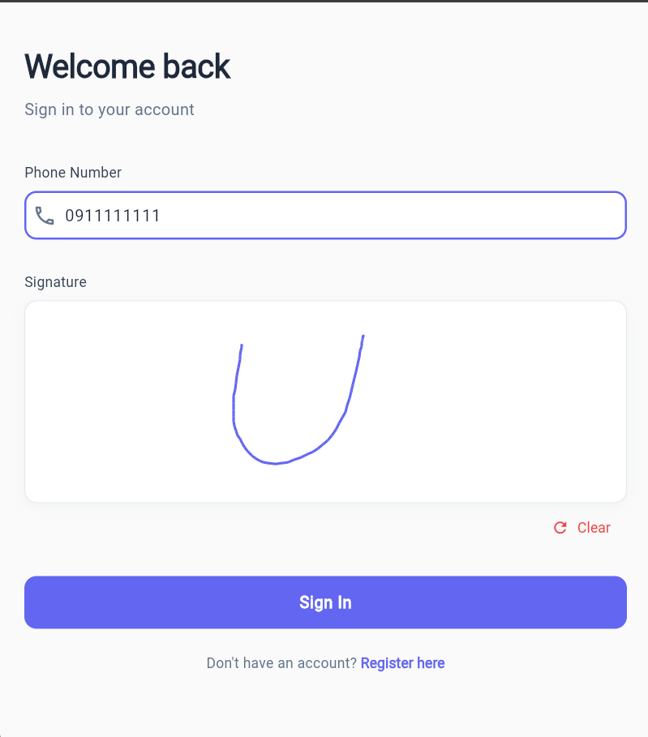

# Digital Attendance App

   
   
   NAME OF STUDENTS              ID NO      
       
1, NATNAEL MULUGETA…………………………..UGR/2097/14

2, NATAN ASRAT……………………………………UGR/5768/14

3, KALEAB ALEBACHEW…………………………UGR/7568/14

4, MAHDER SOLOMON……………………………UGR/4954/14

5, Hilina Nigatu............UGR/5870/14


This is a modern Flutter-based mobile application designed to streamline the process of marking and tracking attendance digitally. The app allows users to register, log in, view their attendance history, and mark new attendance for events using a unique short code and their digital signature.

## Key Features

- **User Registration:** New users can create an account by providing their full name, email address, phone number, and a personal digital signature.

  

- **Secure Login:** Registered users can log in securely using their phone number and digital signature, ensuring a two-factor authentication mechanism.

  

- **Attendance History:** Users can view a comprehensive list of all their past attendance records. Each record is displayed in a clean, modern card layout.

  

- **Detailed Attendance View:** By tapping on an attendance record, users can view detailed information, including the event title, description, organization, and the date the attendance was marked.

  

- **Mark New Attendance:** Users can mark their attendance for a new event by entering a unique event `short code`. The app fetches the event details, and the user confirms their attendance by providing their digital signature.

  

- **Modern & Responsive UI:** The entire application is built with a modern, clean, and intuitive user interface that provides a seamless user experience across different screen sizes.

## Tech Stack

- **Framework:** [Flutter](https://flutter.dev/)
- **State Management:** [Provider](https://pub.dev/packages/provider)
- **HTTP Client:** [http](https://pub.dev/packages/http)
- **Digital Signatures:** [signature](https://pub.dev/packages/signature)
- **Date Formatting:** [intl](https://pub.dev/packages/intl)

## Getting Started

To get a local copy up and running, follow these simple steps.

### Prerequisites

- Flutter SDK: Make sure you have the Flutter SDK installed. For installation instructions, refer to the [official Flutter documentation](https://flutter.dev/docs/get-started/install).
- An editor like VS Code or Android Studio.

### Installation

1.  **Clone the repository:**
    ```sh
    git clone https://github.com/nathe444/attendance-mobile.git
    ```
2.  **Navigate to the project directory:**
    ```sh
    cd attendance-mobile
    ```
3.  **Install dependencies:**
    ```sh
    flutter pub get
    ```
4.  **Run the app:**
    ```sh
    flutter run
    ```

## Project Structure

The codebase is organized into the following directories under `lib/`:

-   `main.dart`: The entry point of the application.
-   `models/`: Contains the data models for the application, such as `User`, `Attendance`, and `Event`.
-   `screens/`: Includes all the UI screens of the app, such as login, registration, attendance list, and detail screens.
-   `services/`: Contains the business logic, including `auth_service.dart` for handling user authentication and `attendance_service.dart` for managing attendance data.
-   `widgets/`: (Optional) Can be used for custom reusable widgets to maintain a consistent UI.

This structure ensures a clean separation of concerns, making the codebase easy to maintain and scale.
